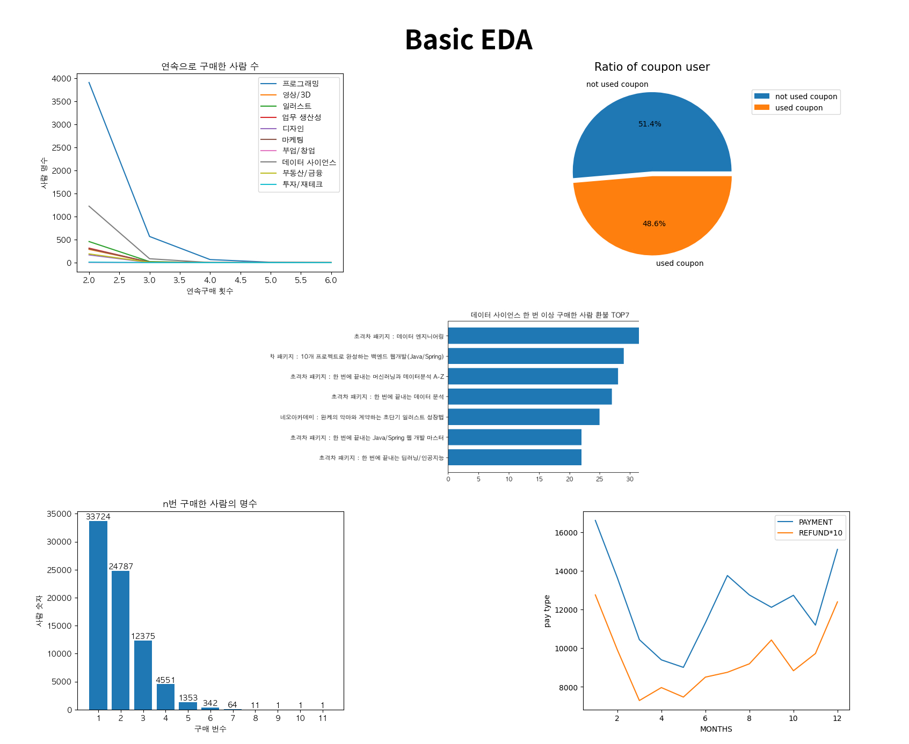

# 패스트캠퍼스 EDA 팀프로젝트

<div style="display:flex;width:100%;">


</div>

<br/>

패스트캠퍼스 1년치 결제 데이터를 활용한 데이터 분석 팀 프로젝트


팀프로젝트의 핵심은 함께하는 것입니다.  
프로젝트 생각은 싹 잊고 노는 것에 집중했습니다.  
커피챗을 하며 친해지는 시간을 가졌습니다.

<br/>
<br/>
<br/>


<br/>

얘기를 나누다보니,  
패스트캠퍼스 매출에 도움을 줄 수 있는 솔루션을 제공하고 싶다는  
마음이 팀원 모두에게 있는 걸 알 수 있었습니다.

공통 목표 내에서  
어떤 솔루션을 제공할 수 있을지 생각해보기 위해  
패스트캠퍼스에서 제공한 데이터를 살펴보기로 했습니다.

<br/>
<br/>

### Column 탐색

데이터의 Column은 무엇이 있는지 살펴보았습니다.

주요 데이터 컬럼은 아래와 같습니다.

```plain
카테고리 (프로그래밍, 데이터사이언스, 일러스트, 마케팅 ...),
상품이름(강의이름),
실거래금액,
거래유형(구매,환불),
쿠폰이름,
쿠폰할인액,
거래일자,
```

<br/>
<br/>

### 기본적인 EDA

기본적인 EDA를 진행했습니다.



다양한 인사이트가 나왔습니다.


```plain
두 번 이상 구매한 고객들은 쿠폰을 사용하지 않는 인원이 더 많았다.
가격은 재구매율과 관련이 없다.
```


```plain
새벽과 주말에는 환불이 안되는 것으로 보아,
환불 시스템이 자동으로 이뤄지지 않고 있음을 확인했다.
```

`가격이 저렴하다고 판매량이 증가하지 않는다.`

### 탐색

뉴스 기사, 여론, 커뮤니티, 패캠 홈페이지 등을 보고  
느끼는 바가 많았습니다.


패캠에서 강의 퀄리티에 신경을 써야  
고객 이탈률이 적어지고 매출이 증가하는 방향으로 갈 수 있지 않을까  
직관적인 느낌이 들었습니다.

주장을 뒷받침하는 객관적인 자료를 어떻게 찾아낼지  
많은 고민을 하기 시작했습니다.

<br/>
<br/>


계속 EDA를 하던 중 **특이한 현상**을 발견했습니다.


구매량과 환불량입니다.

8~10월 사이에는 구매량이 감소하는 추세입니다.  
독특하게도 **일러스트 분야에서만 평균적인 추세와 반대되는 흐름**을  
확인할 수 있었습니다.


일러스트 분야를 더 자세하게 봤습니다.


전체 일러스트 강의 중 네오아카데미의 **강의의 비중**은 31.2%로 낮았지만,  
**거래금액**은 41.9%로 강의의 비중에 비해 많은 매출을 발생시키고 있었습니다.

네오아카데미가 뭐길래 갑자기 잘 팔렸나 궁금해졌습니다.

<br/>
<br/>


- 일러스트 학원이다.
- 실력있는 강사진을 보유했다.

<br/>
<br/>


- 패스트캠퍼스와 mou를 맺었다.

MOU를 통해
매출 성장을 이뤘음을 확인할 수 있었습니다.

<br/>
<br/>

강의의 품질이나, 좋은 여론, 매끄러운 운영 등 다양한 요인이  
재구매에 영향을 끼칠 수 있다고 판단했습니다.

설득할 근거를 수집하기 위해 크롤링을 시작했습니다.

<br/>
<br/>


"패스트캠퍼스" 키워드로  
okky, dc인사이드에서 데이터 수집을 하기 위해  
크롤링을 진행하였습니다.

<br/>
<br/>

dc

okky


패스트캠퍼스와 관련없는 것들을 전처리하고  
긍정 부정을 나누는 작업을 팀원들과 함께 수작업하였습니다.

가공하여 최종적으로 약 400개의 패스트캠퍼스 관련된 후기를 수집하였습니다.

### EDA


프로그래밍 카테고리의 긍정적인 댓글 비율에 비해  
일러스트 쪽의 긍정적인 댓글 비율이 압도적으로 높은 것을 확인할 수 있었습니다.

### wordcloud

불용어 처리를 한 뒤 워드클라우드를 해봤습니다.


완케, 킨티는 일러스트 강사의 이름입니다.  
긍정댓글에서 강사가 좋다고 강의를 추천하는 경우가 많았습니다.

또한 쿠폰을 사용하여 저렴하게 구매할 때  
긍정적인 반응이 있는 경우가 종종 있었습니다.


반면에 부정 댓글에서는 `킨티 강의 뺴고 별로`, `그럴거면 ooo 플랫폼 쓰삼` 등

타 플랫폼과 비교하는 내용이 많았고, 강의 내용에 대해 비평하는 글이 많았습니다.


인프런 키워드로 크롤링하여 워드클라우드를 해봤을 때는,  
`김영한 스프링 강의 좋다`는 평이 많았습니다.

인프런과 네오아카데미 여론을 보았을 때  
좋은 강의가 좋은 여론을 만든다는 점을 확인할 수 있었습니다.


<br/>
<br/>


네오아카데미와  
MOU를 맺어 매출의 상승을 이뤄낸 점  

좋은 강의가 인터넷 여론에 긍정적인 영향을 준 점을 토대로  

강의의 퀄리티는  
매출, 마케팅 성과에 긍정적인 상관관계가 있음을 알 수 잇습니다.

재구매 시 쿠폰 사용률이 50%인 점,
가격과 판매량이 상관관계가 없다는 점은  
강의 퀄리티에 힘을 실어야 한다는 주장을 뒷받침할 수 있다고 생각합니다.

**패스트캠퍼스 플랫폼에서 제공하는  
강의의 퀄리티를 올리기 위한 노력을 한다면  
매출상승을 기대할 수 있지 않을까 조심스럽게 주장해봅니다.**

## With

- 박세훈(데이터분석, PM) : https://github.com/beardfriend
- 이지윤(데이터분석, 개발) 
- 정찬호(데이터분석, 발표)
- 정태훈(데이터분석, 개발) : https://github.com/hctaehoon
- 황도현(데이터분석, 개발)

이어드림 3기 패스트캠퍼스 데이터 분석 프로젝트
